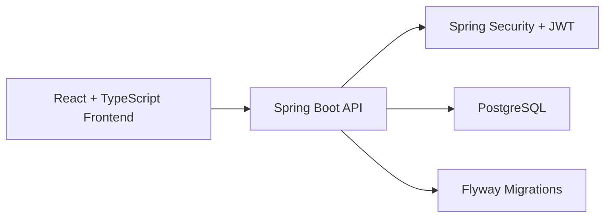

# LockIn Study Tool

LockIn is a full-stack study planning app built with a Spring Boot backend, a React frontend, and PostgreSQL persistence. It gives users one workspace for tasks, deadlines, calendar events, quotes, and account management.

## Stack

- Backend: Java 21, Spring Boot 3, Spring Security, Spring Data JPA, Flyway
- Frontend: React 19, TypeScript, Vite, Vitest
- Database: PostgreSQL 16
- Tooling: Maven, npm, GitHub Actions

## Features

- JWT-based login and signup
- Task creation, editing, completion, deletion, and filtering
- Calendar month view with event creation, editing, completion, and deletion
- Due-soon dashboard and focus lane
- Quote feed with refresh support
- Password updates and account deletion

## Architecture



## Project Layout

```text
backend/   Spring Boot API, database access, auth, and business logic
frontend/  React web client
scripts/   Top-level helper scripts for setup, dev, and checks
```

## Requirements

- Java 21+
- Node.js 20+
- PostgreSQL command-line tools for the local database scripts:
  `initdb`, `pg_ctl`, `pg_isready`, `psql`, `createdb`

If you do not have local PostgreSQL tools installed, you can use the container setup in `docker-compose.yml` instead.

## Quick Start

Install frontend dependencies and warm the backend:

```bash
make bootstrap
```

Start the full local app:

```bash
make dev
```

That flow:

- starts the local PostgreSQL instance on `localhost:55432`
- starts the backend on `http://localhost:8080`
- starts the frontend on `http://127.0.0.1:5173`

Stop the local backend and database:

```bash
make stop
```

## Common Commands

Run the main repo checks:

```bash
make test
```

Build both apps:

```bash
make build
```

Run only the frontend:

```bash
make dev-frontend
```

Run only the backend:

```bash
make dev-backend
```

Run the production-style local stack with Docker:

```bash
make docker-up
```

That stack serves:

- frontend at `http://localhost:4173`
- backend at `http://localhost:8080`
- postgres at `localhost:55432`

## CI

GitHub Actions runs:

- backend tests against PostgreSQL
- frontend lint
- frontend tests
- frontend production build

The workflow lives at `.github/workflows/ci.yml`.

## Deployment Notes

- [backend/Dockerfile](backend/Dockerfile) packages the API as a container image
- [frontend/Dockerfile](frontend/Dockerfile) builds the React client and serves it with Nginx
- [docker-compose.yml](docker-compose.yml) runs the full stack together for a production-style preview
- The frontend keeps `/api` requests same-origin and proxies them to the backend through Nginx in containers

## API and App Docs

- Backend setup and API endpoints: [backend/README.md](backend/README.md)
- Frontend setup and environment notes: [frontend/README.md](frontend/README.md)
